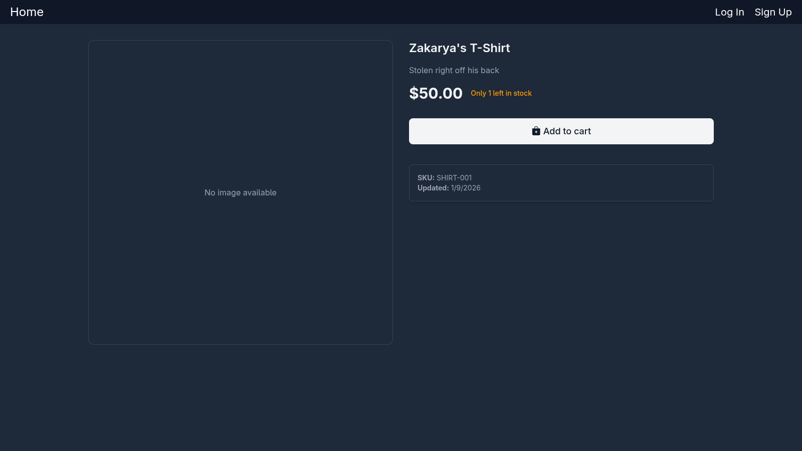
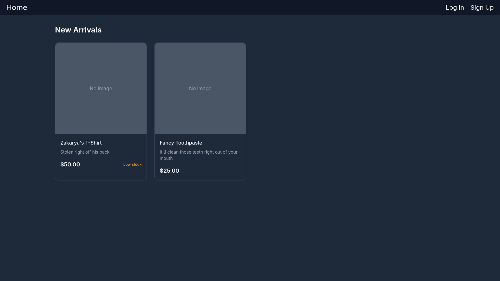

# ColormaticStudios/ecommerce: A self-hostable ecommerce platform

A RESTful ecommerce API built with Go, Gin, GORM, and PostgreSQL.

> [!WARNING]
> This project was partially vibe-coded. I have not reviewed all of the code, I cannot guarantee quality, use at your own risk.

### See [frontend/README.md](frontend/README.md) for details about the frontend.

## Screenshots




## Features

- **Authentication & Authorization**
   - Cookie-based authentication (HttpOnly session cookie)
   - User registration and login
   - Role-based access control (admin/customer)
   - OpenID Connect support

- **Product Management**
   - Product CRUD operations (admin)
   - Product search and filtering
   - Pagination support
   - Price range filtering
   - Sorting (by price, name, date)
   - Stock/inventory management

- **Shopping Cart**
   - Add items to cart
   - Update cart item quantities
   - Remove items from cart
   - View cart

- **Order Management**
   - Create orders
   - View order history
   - Order status tracking (PENDING, PAID, FAILED)
   - Mock payment processing
   - Admin order management

- **User Management**
   - User profiles
   - Profile updates
   - Admin user management

## Prerequisites

- Go 1.21 or higher
- Docker or Podman (for running Postgres database)
- Make
- FFmpeg (for media processing)
- NPM/Bun/Yarn/PNPM (for frontend)

## Setup

1. **Clone the repository**

   ```bash
   git clone https://git.colormatic.org/ColormaticStudios/ecommerce.git
   cd ecommerce
   ```

2. **Install dependencies**

   ```bash
   go mod download
   ```

3. **Set up environment variables**

   ```bash
   cp .env.example .env
   # Edit .env with your configuration
   ```

   Optional non-secret defaults via TOML:

   ```bash
   cp config/config.example.toml config.toml
   # Edit config.toml with non-secret settings
   ```

4. **Run a temporary database**

   ```bash
   sudo scripts/run-dev-db-docker.sh
   # Or
   scripts/run-dev-db-podman.sh
   ```

5. **Start the backend**

   ```bash
   make run
   ```

   Or build and run:

   ```bash
   make api
   bin/ecommerce-api
   ```

6. **Populate the database with placeholder products**

   ```bash
   scripts/populate-test-database.sh
   ```

7. **Start the frontend**

   ```bash
   cd frontend
   bun install
   bun run dev --open
   ```

Note: the placeholders that the AI generated are cringe but funny, so I left them in.

## Environment Variables

See `.env.example` for all required environment variables.

You can also provide non-secret defaults in `config.toml` (see
`config/config.example.toml`). Config precedence is:

1. Environment variables (highest priority)
2. `.env`
3. `config.toml` (lowest priority)

- `DATABASE_URL`: PostgreSQL connection string
- `PORT`: Server port (default: 3000)
- `JWT_SECRET`: Secret key for JWT token signing
- `DISABLE_LOCAL_SIGN_IN`: Disable local sign-in (default: false)
- `OIDC_PROVIDER`: OIDC provider URL (optional)
- `OIDC_CLIENT_ID`: OIDC client ID (optional)
- `OIDC_CLIENT_SECRET`: OIDC client secret (optional)
- `OIDC_REDIRECT_URI`: OIDC redirect URI (optional)
- `DEV_MODE`: Whether to allow connections from localhost (optional)
- `PUBLIC_URL`: What host to allow connections from in production

### Auth Cookies (Dev vs Prod)

- Development (`DEV_MODE=true`): auth cookie is `HttpOnly`, `SameSite=Lax`, `Secure=false` so login works over `http://localhost`.
- Production (`DEV_MODE=false`): auth cookie is `HttpOnly`, `SameSite=None`, `Secure=true`.
- Frontend requests must include credentials (for example `fetch(..., { credentials: "include" })`).

## API Endpoints

See [API.md](API.md) for documentation on the API.

### OpenAPI Contract and Type Generation

The repository now includes an OpenAPI contract at `api/openapi.yaml` used to
generate shared backend and frontend types.

- Generate all contract artifacts:

  ```bash
  make openapi-gen
  ```

- Validate generated files are up to date (CI-friendly):

  ```bash
  make openapi-check
  ```

- Generate API documentation from the OpenAPI contract:

  ```bash
  make openapi-docs
  ```

## CLI Tool

The project includes a command-line tool for administrative tasks.

### Building the CLI

```bash
make cli
```

### CLI Commands

#### User Management

**Set a user as admin:**

```bash
bin/ecommerce-cli user set-admin --email user@example.com
# or by username
bin/ecommerce-cli user set-admin --username johndoe
```

**Create a new user:**

```bash
bin/ecommerce-cli user create \
  --email admin@example.com \
  --username admin \
  --password securepassword \
  --name "Admin User" \
  --role admin
```

**List all users:**

```bash
bin/ecommerce-cli user list
# Filter by role
bin/ecommerce-cli user list --role admin
```

**Delete a user:**

```bash
bin/ecommerce-cli user delete --email user@example.com
# Skip confirmation
bin/ecommerce-cli user delete --email user@example.com --yes
```

#### Product Management

**Create a product:**

```bash
bin/ecommerce-cli product create \
  --sku PROD-001 \
  --name "Product Name" \
  --description "Product description" \
  --price 29.99 \
  --stock 100
```

**List products:**

```bash
bin/ecommerce-cli product list
# Limit results
bin/ecommerce-cli product list --limit 10
```

**Edit a product:**

```bash
# Change stock to 20
bin/ecommerce-cli product edit \
	--id 1 \
	--stock 20
# Products can be identified by either ID or SKU

# Change SKU
bin/ecommerce-cli product edit \
	--sku PROD-001 \
	--new-sku PROD-002
```

**Set related products:**

```bash
bin/ecommerce-cli product related-set --id 1 --related-id 2,3,4
# or by SKU
bin/ecommerce-cli product related-set --sku PROD-001 --related-sku PROD-002 --related-sku PROD-003
```

**Upload media and attach to a product:**

```bash
bin/ecommerce-cli product media-upload \
  --id 1 \
  --file ./path/to/image.jpg \
  --api-base http://localhost:3000 \
  --token <admin-jwt>
```

**Delete a product:**

```bash
bin/ecommerce-cli product delete --id 1
# or by SKU
bin/ecommerce-cli product delete --sku PROD-001
```

### CLI Help

Get help for any command:

```bash
bin/ecommerce-cli --help
bin/ecommerce-cli user --help
bin/ecommerce-cli user set-admin --help
```

## Development

### Running Tests

```bash
# Run all tests
make test
```

The test suite includes:

- **Authentication tests** - JWT generation, password hashing, subject ID generation
- **Validation tests** - Currency validation, product validation, input validation
- **Business logic tests** - Order total calculation, stock validation, pagination
- **Middleware tests** - Auth middleware with various scenarios (valid/invalid tokens, role requirements, expired tokens)

### Building for Production

**API Server:**

```bash
go build -o bin/ecommerce-api -ldflags="-s -w" main.go
```

**CLI Tool:**

```bash
go build -o bin/ecommerce-cli -ldflags="-s -w" ./cmd/cli
```

### Database Migrations

Migrations are handled automatically by GORM on server start.
